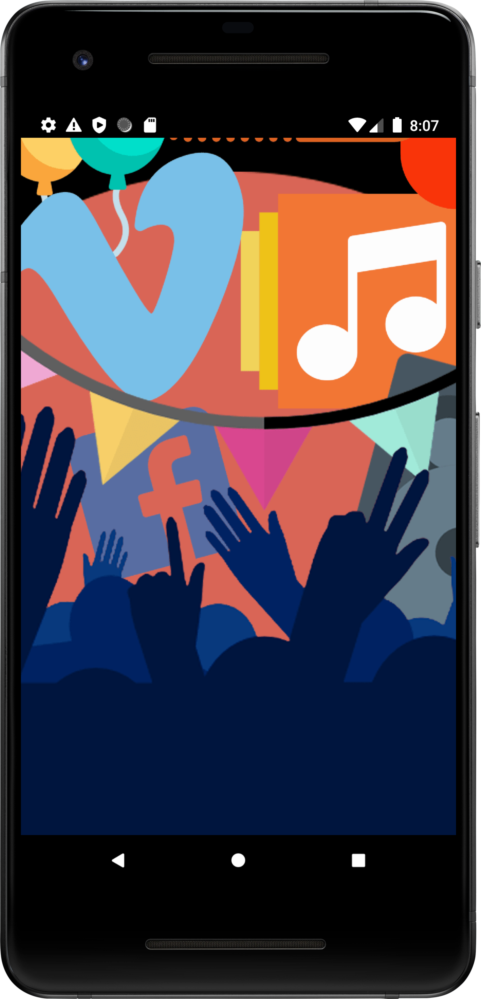
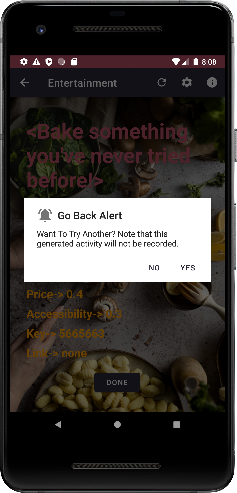

# Entertainment Android App (Ver. 05/04/2021)

## Icon
  

## Overview

<!--    -->
<!--  -->

## Description

The Entertainment app is a dynamic Android application designed to alleviate boredom by providing users with randomly generated activities. Leveraging the 'Bored API,' the app fetches data associated with various activities, encompassing key information such as activity name, type, participants, price, accessibility, key, and link.

[Bored API](https://www.boredapi.com/)

## Table of Contents

1. [Features](#features)
2. [Environment](#environment)
3. [Screenshots](#screenshots)
4. [Image Use Disclaimer](#image-use-disclaimer)

## Features

### 1. Activity Generation

In the main fragment, users can select from three options: 'Colorview', 'Webview', or 'Activities'. The 'Colorview' and 'Webview' fragments maintain consistency with previous assignments, meeting RecyclerView and Webview grading requirements.

Choosing 'Activities' navigates users to the detail fragment, allowing them to customize the generation parameters. Upon selecting parameters for activity generation, users are directed to the result fragment, showcasing the activity retrieved from the API. The app's background automatically adapts to the type of activity generated, enhancing visual appeal.

### 2. User Settings

The Settings screen provides users access to three application settings, stored using SharedPreferences. This enhances the user experience by allowing customization according to individual preferences.

A context menu in the main fragment allows users to switch the avatar image from 'avatar_1' to 'avatar_2,' adding an extra touch of personalization.

### 3. App Information

The info screen dynamically retrieves and displays application information, including version name and version code. This information is presented alongside the app icon and a copyright note.

## Environment

Since this is an old Android project, please make sure versions are compatible:
1. Android Studio (Entertain App uses Android Studio Bumblebee | 2021.1.1)
2. Gradle (Entertain App uses v7.2)
3. Emulator (Release 31.2.8 (February 7, 2022) has been tested with Bumblebee Patch 1 and Chipmunk Canary 6)

For more instructions on how to set up the environment needed for this Entertainment App, please refer to [instructions.md](./instructions/instructions.md)

## Screenshots

1. The Entertainment App starts with a spash screen; Navigate the 'Colorview,' 'Webview,' or 'Activities' section in the main fragment.  

  

2. Customize activity generation parameters in the detail fragment.  

  

3. View the generated activity in the result fragment, with background dynamically adapting to the activity type. The alert pops up when going back.  

  

## Image Use Disclaimer

I have used images in the Entertainment App that are believed to be in the public domain or available under creative commons licenses. If you are the copyright holder of an image in the app and it has been used without proper rights, please contact me. I will promptly address the issue by either obtaining the correct permissions or removing the image.  

---
Enjoy exploring a variety of activities and banishing boredom with the Entertainment App!  

[leeklee0427](https://github.com/leeklee0427)  
Last Edited on: 01/06/2024