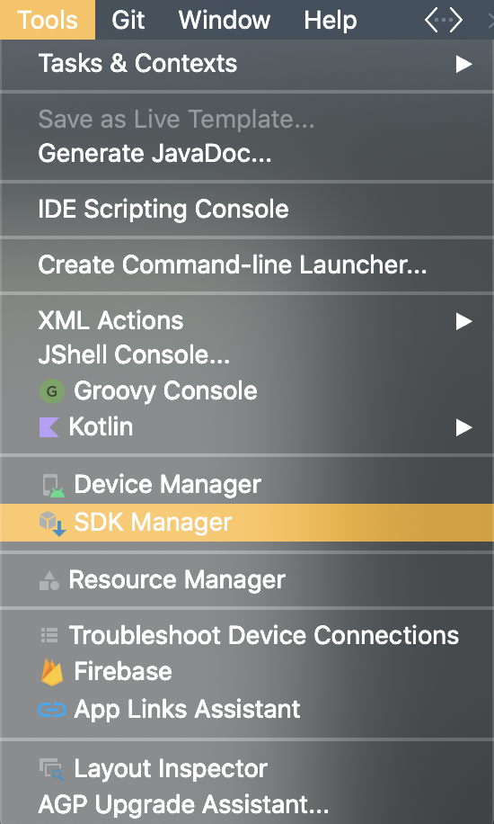
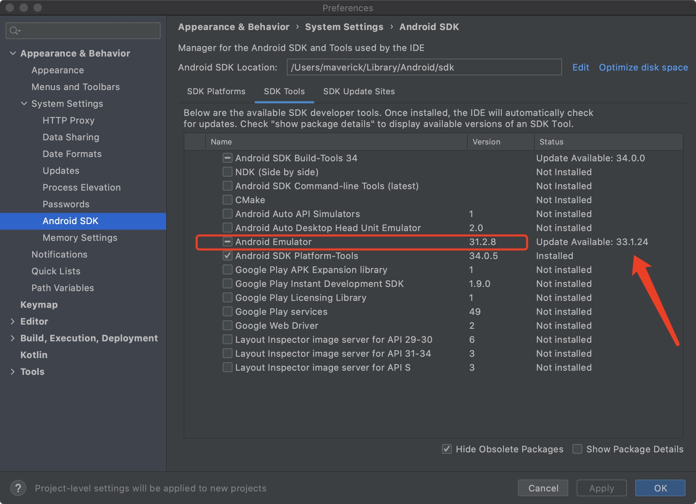

# Building and Running an Old Android Project (01/06/2024)

## Outline
Make sure versions are compatible:
1. Android Studio (Entertain App uses Android Studio Bumblebee | 2021.1.1)
2. Gradle (Entertain App uses v7.2)
3. Emulator (Release 31.2.8 (February 7, 2022) has been tested with Bumblebee Patch 1 and Chipmunk Canary 6)


## Details

### 1. Downgrade Android Studio;  
If the Android Studio version is incompatible, you are likely to encounter two types of errors:  
* "IDE error occured"
* "This version of the Android Support plugin for IntelliJ IDEA or Android Studio cannot open this project, please retry with version 2021.1.1 or newer"
    - This happens when your Gradle plugin version is higher than the IDE version. You can either:
        - Downgrade Gradle
        - Update Android Studio

### 2. Check Gradle version;
The Gradle version is specified in ```gradle/wrapper/gradle-wrapper.properties```
```
distributionUrl=https\://services.gradle.org/distributions/gradle-7.2-bin.zip
```

### 3. Downgrade Emulator;  
Emulator version might be incompatible (automatically upgraded to the latest version)  

---

First, start the emulator from the command line, check for error messages  

```bash
cd /Users/maverick/Library/Android/sdk/emulator/emulator
```

```bash
/Users/maverick/Library/Android/sdk/emulator/emulator -avd Pixel_2_API_27 -netdelay none -netspeed full
```

```bash
INFO    | Android emulator version 33.1.24.0 (build_id 11237101) (CL:N/A)
INFO    | Found systemPath /Users/maverick/Library/Android/sdk/system-images/android-27/google_apis_playstore/x86/
dyld: Symbol not found: _vmnet_enable_isolation_key
  Referenced from: /Users/maverick/Library/Android/sdk/emulator/qemu/darwin-x86_64/qemu-system-i386 (which was built for Mac OS X 11.1)
  Expected in: /System/Library/Frameworks/vmnet.framework/Versions/A/vmnet
 in /Users/maverick/Library/Android/sdk/emulator/qemu/darwin-x86_64/qemu-system-i386
zsh: abort      /Users/maverick/Library/Android/sdk/emulator/emulator -avd Pixel_2_API_27
```

---

Second, check Android Emulator release notes, download the older version of Emulator and replace current Emulator  

```bash
cp emulator/package.xml bak-package.xml
rm -rf emulator
unzip ~/Downloads/emulator-darwin_x64-8143646.zip -d .
xattr -dr com.apple.quarantine emulator/
cp bak-package.xml emulator/package.xml
```

Finally, change the emulator version specified in the package.xml file to the version you have downloaded and want to use. To do this, scroll to the bottom of the package.xml file and manually change ```<revision><major>31</major><minor>2</minor><micro>8</micro></revision>```  


  
  
<!--  -->


## References
Android Studio download archives  
https://developer.android.com/studio/archive  

Gradle Releases  
https://gradle.org/releases/  

Start the emulator from the command line  
https://developer.android.com/studio/run/emulator-commandline#:~:text=The%20AVD%20data%20directory%2C%20also,android%2Favd%2F%20name%20  

Android Emulator release notes  
https://developer.android.com/studio/releases/emulator#31-2-8  

Emulator download archives  
https://developer.android.com/studio/emulator_archive  

Downgrading emulator  
https://developer.android.com/studio/emulator_archive  
https://gist.github.com/0x0a0d/d3ce82f72e8f5681649b129d8a84e46b  


Versions used in Entertain App  
Android Studio: https://redirector.gvt1.com/edgedl/android/studio/install/2021.1.1.20/android-studio-2021.1.1.20-mac.dmg  
Emulator: https://redirector.gvt1.com/edgedl/android/repository/emulator-darwin_x64-8143646.zip  

---

[leeklee0427](https://github.com/leeklee0427)  
Last Edited on: 01/06/2024
